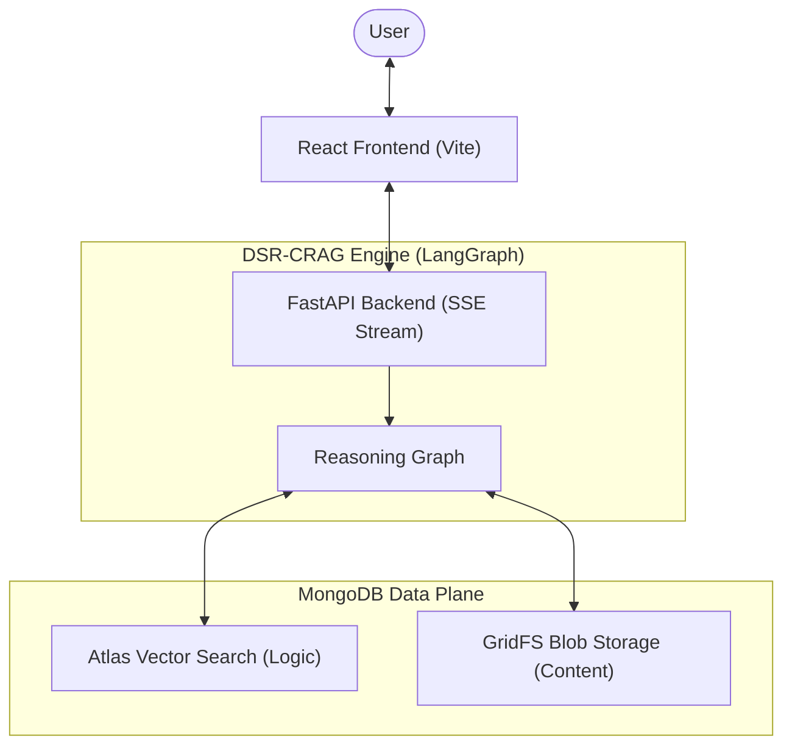
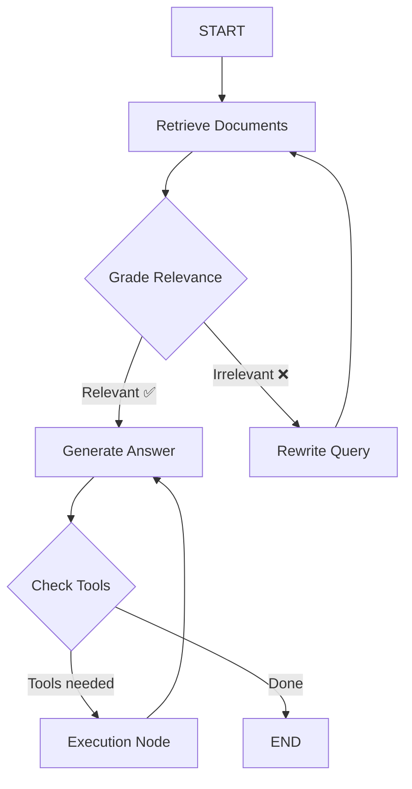
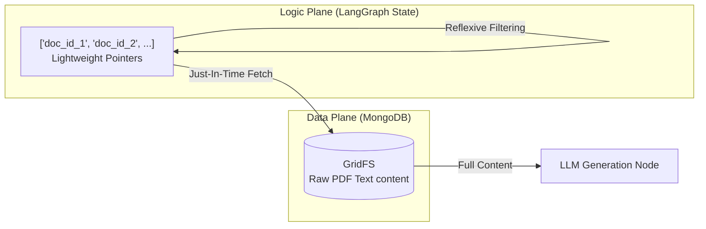

# DSR-CRAG: Dual-State Reflexive Corrective Retrieval-Augmented Generation

This document outlines the methodology and architectural design behind the **DSR-CRAG** application, detailing exactly why it is highly effective at reducing hallucinations and processing massive datasets.

## High-Level Architecture

## The Problem with Standard RAG
Traditional Retrieval-Augmented Generation (RAG) pipelines follow a simple, linear flow:
1. User asks a question.
2. System fetches top-k similar vectors.
3. System injects the text from those vectors into the LLM prompt.
4. LLM answers.

**The Flaws in Standard RAG:**
- **Irrelevant Context:** If the vector search returns poorly matched chunks, the LLM hallucinates an answer based on bad data.
- **Context Window Bloat:** Passing large, raw text directly into the graph state/memory at every step causes memory bloat, high latency, and expensive token consumption.
- **No Self-Correction:** If the initial vector search fails, the traditional system just gives up or guesses.

---

## 🚀 The DSR-CRAG Methodology

DSR-CRAG solves these problems through two major architectural innovations: **Reflexive Correction (C-RAG)** and **Dual-State Pointer Offloading**.

## Graph Execution Flow

### 1. Reflexive Correction (The "Grader" Node)
Instead of blindly trusting the vector database results, DSR-CRAG introduces an intelligent, reflexive evaluation loop natively built in LangGraph.

When documents are retrieved, they do not immediately go to the text generator. First, they pass through the **Grader Node**:
- **Semantic Evaluation:** A structured LLM (configured to output binary `yes`/`no` relevance scores) reads the retrieved context.
- **Filtering:** If a document chunk is deemed irrelevant to the user's specific query, it is discarded. Only high-quality, relevant context survives.

**Why this works so well:**
This acts as a strict cognitive filter. By mathematically forcing the LLM to verify Relevance *before* giving it the freedom to Generate, we cut off the primary source of hallucinations: bad context. Grounding is strictly enforced because the generator node *only* sees approved, verified text.

### 2. The Self-Correction Loop (Query Rewrite)
If the Grader determines that *all* retrieved documents are irrelevant, the system does not give up. Instead, it triggers a **Self-Correction Loop**:
- The agent realizes its vector search failed.
- It routes to a **Rewrite Node**, which uses an LLM to translate the user's original intent into a better, more optimized search query.
- The system loops back to the retrieval phase automatically using the new query.

**Why this works so well:**
Users frequently ask poorly phrased questions, or use vocabulary that doesn't exactly match the indexed PDFs. Vector embeddings are brittle to these shifts. The Rewrite Node acts as an automated search optimization agent, allowing the system to try multiple semantic angles until it hits the correct data.

---

### 3. Dual-State Architecture (GridFS Pointer Offloading)
The most significant engineering challenge in multi-agent RAG is managing the Graph State. Passing 50,000 tokens of PDF text between 5 different agent nodes in memory is disastrous for performance.

## Dual-State Pointer Offloading

**The Pointer-Based Solution:**
DSR-CRAG uses a highly optimized **Dual-State** design bridging MongoDB Atlas Vector Search and MongoDB GridFS.

1. **The Vector Store (Atlas):** Holds only tiny, dense embeddings and a metadata pointer (`gridfs_file_id`).
2. **The Blob Store (GridFS):** Holds the massive, raw text chunks of the actual PDFs.
3. **The LangGraph State:** Never holds raw text. The state only passes lightweight pointers (IDs) between nodes.

When the Grader filters documents, it is only passing around arrays of strings (e.g., `["65a4f...", "65a5b..."]`).

**JIT (Just-In-Time) Materialization:**
Only at the very last microsecond, inside the `generate_answer` node, does the backend actually resolve those `file_ids` by querying the GridFS blob storage. The text is assembled and injected directly into the final Prompt.

**Why this works so well:**

- **Incredible Speed and Low Memory:** Agent graphs loop extremely fast because they are only processing state arrays containing lightweight IDs.
- **Scalability:** You can index 5,000-page engineering manuals. The graph will never crash from passing the textbook around in memory, because the textbook lives safely in GridFS until the exact moment the generator needs to read it.

This architecture treats the LangGraph state as a **Logic Control Plane** and MongoDB as the **Data Plane**. By separating the "thinking" (IDs) from the "content" (PDF text), the system remains lightning-fast regardless of whether the source document is a 1-page memo or a 1,000-page technical manual. 

Grounding is improved because the system can track the "Lineage" of a piece of data through its database ID, rather than a potentially mutated or truncated string in local memory.

### 4. Grounding via Iterative Refinement (C-RAG)

The "Corrective" aspect of DSR-CRAG (the C-RAG loop) is its secondary grounding defense. Even with top-tier embeddings, vector search often returns "Near-Misses"—documents that are semantically close but factually irrelevant.

#### The "Grounding Trap"
In standard RAG, if a search returns a near-miss, the LLM often tries to "be helpful" by hallucinating a bridge between the user's question and the irrelevant text. This is a grounding failure.

#### The DSR-CRAG Solution:
By implementing a **Reflexive Loop**, we create a multi-pass grounding strategy:

1. **Gatekeeping**: The Grader Node acts as a binary gate. If the retrieved pointers don't meet the "Strict Grounding Threshold," they are locked out of the generator.
2. **Semantic Transformation**: Instead of failing, the system uses its "Self-Correction" capability to rewrite the query. It doesn't just re-send the same query; it generates a **High-Fidelity Search Variant** that looks for the underlying concepts rather than the literal words.
3. **Looping**: The graph cycles back. This "Second Chance" ensures that the generator node *only* receives data that has been thrice-verified:
    - Verified by the **Vector Index** (Similarity).
    - Verified by the **Grader LLM** (Relevance).
    - Verified by the **Query Rewriter** (Optimal Intent).

This methodology ensures that the final response isn't just "likely" correct, but is explicitly anchored in a verified data pipeline.

---

## Summary of Grounding & Accuracy

By combining **Reflexive Grading** (to kill bad context), **Query Rewriting** (to recover from bad searches), and **Pointer-Based JIT Loading** (to allow massive scale without memory bottlenecks), DSR-CRAG creates a reasoning engine that acts fundamentally closer to a human researcher:

1. Look up data.
2. Verify if the data is actually useful.
3. If not, refine the search terms and try again.
4. Once verified data is found, read it and synthesize the final answer.
